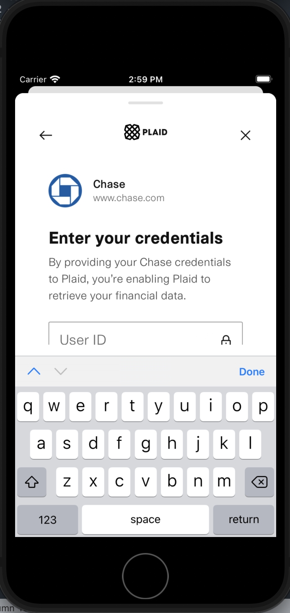

# Introduction (수정중)

<h3>당신이 부러운 여행지, 부럽 (외주 프로젝트)</h3>

1. Service Scope: [Web](https://www.boolub.com/) / Android / IOS

- Android / IOS 앱은 3월 중 출시 예정

2. Application Developing Tool: Flutter / Android Studio / X Code
3. Server Configuration: Ubuntu / AWS
4. BackEnd Developing Tool: PHP / PHPMyAdmin (RDBMS) / 클라이언트 솔루션
5. Native App Performance

- 인 앱 Push 서비스: Firebase Cloud Messaging
- GPS: Geolocator
- 만보기: Pedometer / WorkManager
- In App WebView PG 결제: Toss Payments SDK

# External Plugin List

1. cupertino_icons: ^1.0.2
2. geolocator: ^10.1.0
3. permission_handler: ^11.0.1
4. geocoding: ^2.1.1
5. shared_preferences: ^2.2.2
6. url_launcher: ^6.2.1
7. package_info: ^2.0.2
8. flutter_webview_pro: ^3.0.1+4
9. webview_cookie_manager: ^2.0.6
10. firebase_core: ^2.22.0
11. firebase_crashlytics: ^3.4.4
12. firebase_analytics: ^10.6.4
13. firebase_messaging: ^14.7.4
14. flutter_local_notifications: ^9.1.5
15. get: ^4.6.6
16. get_storage: ^2.1.1
17. http: ^1.1.0
18. geolocator_android: ^4.4.0
19. geolocator_apple: ^2.3.2
20. fluttertoast: ^8.2.4
21. pedometer: ^4.0.1
22. tosspayments_widget_sdk_flutter: ^1.0.2
23. intl: ^0.18.1
24. font_awesome_flutter: ^10.6.0
25. device_info_plus: ^9.1.1
26. android_id: ^0.3.6
27. fk_user_agent: ^2.1.0
28. workmanager: ^0.5.2

# Issue01

<h3>TextField Focusing Issue on Android WebView</h3>

    
1. 안드로이드 시스템의 소프트 키보드가 차지한 영역만큼 화면이 밀려 올라가지 않는 문제

    
2. 사용자가 선택한 TextField 위치로 Focusing이 되지 않는 문제

    

    
문제를 바라보는 관점에 따라 접근 방법 역시 달라진다.

    
1번 문제라면 네이티브 앱에서만 취할 수 있는 조치들이 있다.

    
2번 문제라면 웹에서 취할 수 있는 조치와 연관지어서 접근해야 한다.

    
네이티브적 접근방식 만으로는 문제 해결이 어려울 수도 있다는 뜻이다.

    <h4>1. 안드로이드 시스템의 소프트 키보드가 차지한 영역만큼 화면이 밀려 올라가지 않는 문제</h4>
    
1) SingleChildScrollView

    
대부분의 상황에서는 SingleChildScrollView 위젯을 사용하면 해결된다.

    
화면 전체를 자연스럽게 스크롤이 가능한 영역으로 잡는다는 접근방식이다.

    
TextField 위젯이 소프트 키보드에 가려질 때 가장 먼저 시도 해볼만 하다.

    
기본적으로 List 객체에 담긴 데이터 값들을 Row에서 렌더링할 때 쓰는 방법이다.

    
결과적으로는 문제를 해결하지 못했다.

    
2) Adjust Resize

    
안드로이드 설정 자체를 건드리는 방법도 있다.

    
'AndroidManifest.xml' 파일에서 'activity' 설정 값을 변경하는 것이다.

    
보통 'android:windowSoftInputMode' 값을 'adjustResize'로 설정한다.

    
디버깅 결과, 효과가 전혀 없는 것은 아니었다.

    
결과적으로는 TextField를 터치하였을 때, 키보드 영역만큼 화면이 밀려 올라가기는 했다.

    
문제는 이 동작이 열 번이면 열 번 전부 동일하게 작동하지는 않았다는 것이다.

    
짐작하기로는 MediaQuery가 안드로이드 웹뷰에서 완전하게 동기화 되지는 않는 것 같다.

    
다만, 이제는 접근 방법을 달리 해볼 필요가 있다는 것이다.

    <h4>2. 사용자가 선택한 TextField 위치로 Focusing이 되지 않는 문제</h4>
    
2222

# Issue02

# Issue03
