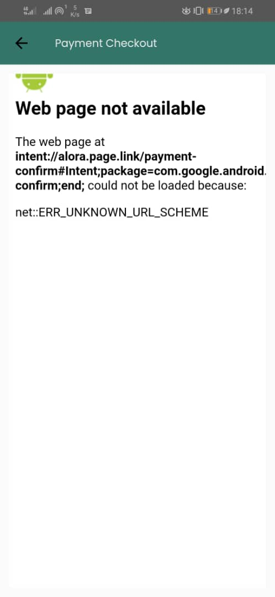
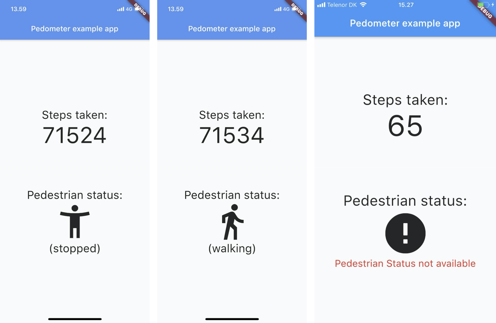

# Introduction

<h3>당신이 부러운 여행지, 부럽 (외주 프로젝트)</h3>

1. Service Scope: [Web](https://www.boolub.com/) / Android / IOS

- Android / IOS 앱은 3월 중 출시 예정

2. Application Developing Tool: Flutter / Android Studio / X Code
3. Server Configuration: Ubuntu / AWS
4. BackEnd Developing Tool: PHP / PHPMyAdmin (RDBMS) / 고객사 솔루션
5. Native App Performance

- inApp Push Service: Firebase Cloud Messaging
- GPS: Geolocator
- 만보기: Pedometer / WorkManager
- inAppWebView PG 결제: Toss Payments SDK

# External Plugin List

1. cupertino_icons: ^1.0.2
2. geolocator: ^10.1.0
3. permission_handler: ^11.0.1
4. geocoding: ^2.1.1
5. shared_preferences: ^2.2.2
6. url_launcher: ^6.2.1
7. package_info: ^2.0.2
8. flutter_webview_pro: ^3.0.1+4
9. webview_cookie_manager: ^2.0.6
10. firebase_core: ^2.22.0
11. firebase_crashlytics: ^3.4.4
12. firebase_analytics: ^10.6.4
13. firebase_messaging: ^14.7.4
14. flutter_local_notifications: ^9.1.5
15. get: ^4.6.6
16. get_storage: ^2.1.1
17. http: ^1.1.0
18. geolocator_android: ^4.4.0
19. geolocator_apple: ^2.3.2
20. fluttertoast: ^8.2.4
21. pedometer: ^4.0.1
22. tosspayments_widget_sdk_flutter: ^1.0.2
23. intl: ^0.18.1
24. font_awesome_flutter: ^10.6.0
25. device_info_plus: ^9.1.1
26. android_id: ^0.3.6
27. fk_user_agent: ^2.1.0
28. workmanager: ^0.5.2

# Issue01

<h3>TextField Focusing Issue on Android WebView</h3>

    
1. 소프트 키보드가 차지한 영역만큼 화면이 밀려 올라가지 않는 문제

    
2. 사용자가 선택한 TextField 위치로 Focusing이 되지 않는 문제

    

    
문제를 바라보는 관점에 따라 접근 방법 역시 달라진다.

    
1번 문제라면 네이티브 앱에서만 취할 수 있는 조치들이 있다.

    
2번 문제라면 웹 서버에서 취할 수 있는 조치와 연관지어서 접근해야 한다.

    <h4>1. 소프트 키보드가 차지한 영역만큼 화면이 밀려 올라가지 않는 문제</h4>
    
1) SingleChildScrollView

    
대부분의 상황에서는 SingleChildScrollView 위젯을 사용하면 해결된다.

    
화면 전체를 자연스럽게 스크롤이 가능한 영역으로 잡는다는 접근방식이다.

    
TextField 위젯이 소프트 키보드에 가려질 때 가장 먼저 시도 해볼만 하다.

    
기본적으로 List 객체에 담긴 데이터 값들을 Row에서 렌더링할 때 쓰는 방법이다.

    
결과적으로는 문제를 해결하지 못했다.

    
2) Adjust Resize

    
안드로이드 설정 자체를 건드리는 방법도 있다.

    
'AndroidManifest.xml' 파일에서 'activity' 설정 값을 변경하는 것이다.

    
보통 'android:windowSoftInputMode' 값을 'adjustResize'로 설정한다.

    
디버깅 결과, 효과가 전혀 없는 것은 아니었다.

    
결과적으로는 TextField를 터치하였을 때, 키보드 영역만큼 화면이 밀려 올라가기는 했다.

    
문제는 이 동작이 열 번이면 열 번 전부 동일하게 작동하지는 않았다는 것이다.

    
짐작하기로는 MediaQuery가 안드로이드 웹뷰에서 완벽하게 동기화되지 않는 것 같다.

    
다만, 이제는 접근 방법을 달리 해볼 필요가 있다는 것이다.

    <h4>2. 사용자가 선택한 TextField 위치로 Focusing이 되지 않는 문제</h4>
    
문제의 원인을 웹 서버에서 찾으려고 한다면 관점이 살짝 달라진다.

    
소프트 키보드가 차지한 영역만큼 화면이 밀려 올라가는 것과,

    
사용자가 터치한 TextField 위치로 시점이 전환되는 것은 어감에서 오는 느낌부터가 사뭇 다르다.

    
부럽 앱은 기본적으로 반응형 웹을 패키징한 구조이기 때문에 이 부분은 JavaScript로 해결할 수 있다.

    
해당 <a href="https://github.com/academy3746/walker/blob/main/lib/features/main_screen/main_screen.dart#L475">라인</a>을 참조 바란다.

    
위, 아래 TextField (input, textArea) 어디를 터치하든지 간에 자연스럽게 시점이 이동한다.

    
또한, 네이티브 앱과 유사한 경험을 제공하기 위해 500ms 정도의 Interval을 두고 작동한다.

# Issue02

<h3>URL Scheme Issue on Flutter inAppWebView</h3>

    
기구축된 Toss Payments PG결제가 앱에서 정상작동 하지 않는 문제

    

    
Toss Payments는 다양한 플랫폼에서의 간편 결제 서비스를 지원한다.

    
특히 One Touch 결제가 가능한 네이버, 카카오페이 등이 서비스의 핵심이다.

    
문제는 플랫폼마다 서로 다른 URL 스키마를 결과값으로 반환한다는 것이다.

    
가령, 카카오페이의 경우는 'kakao://'와 같은 포맷으로 결제를 요청한다.

    
각종 카드사들은 더 말할 것도 없을 것이다.

    
물론, TOSS사의 백엔드 개발자들이 이 점을 간과했을 리가 없다.

    
그 증거로 Toss Payments 제공하는 PG결제는 모두 일관된 URL 타입으로 파싱이 된 상태이다.

    
<strong><a href="#" onclick="return false">https://payment-gateway.tosspayments.com/pc/payment-method/digital-wallet/option?token=${SAMPLE}&gtid=${SAMPLE}&cardCode=KAKAOPAY</a></strong>

    
네이버페이의 경우, cardCode의 GET값이 'NAVERPAY', 토스페이는 'TOSSPAY' 와 같은 식이다.

    
하지만 TOSS 개발자들의 세심한 안배는 딱 거기까지이다.

    
Flutter 앱에서 간편 결제를 진행하였을 때는 여전히 URL Scheme 에러가 발생하지만...

    
스마트폰에 설치된 크롬 내지 사파리 브라우저는 해당사항이 없었기 때문이다.

    
아쉽지만 이러한 조치는 Mobile Web 환경까지만 고려한 것 같다.

    

    
그래도 여기까지 접근했다면 문제를 거의 해결한 것과 진배하다.

    
TOSS 개발자들이 그러하였듯이 앱에서도 동일하게 외부 URL을 파싱하는 것이다.

    
사실, 호언장담 했던 것만큼 간단한 작업은 아니다.

    
Scheme 에러를 발생시킬 법한 요소를 찾아내어 필터링 하는 과정이 필요하다.

    
특정 패턴의 문자열을 분리하거나 대체하는 등의 가공 처리 말이다.

    
필자의 역량으로는 여기까지가 한계였다.

    
하지만 Flutter에는 한계가 없나보다.

    
Toss Payments PG결제만을 위한 <a href="https://pub.dev/packages/tosspayments_widget_sdk_flutter">플러그인</a>이 따로 있을 줄이야?

    
필자가 필요로 하는 모든 요구사항이 플러그인에 내장되어 있으니 가져다 쓰기만 하면 되는 것이다.

    
상세한 작업 내용은 <a href="https://github.com/academy3746/walker/blob/main/lib/features/main_screen/main_screen.dart#L507">링크</a>를 참조 바란다.

    
그래도 간략하게나마 로직을 설명해보도록 하겠다.

    
우선 프로젝트에서 'tosspayments_url.dart' 패키지를 <a href="https://github.com/academy3746/walker/blob/main/lib/features/main_screen/main_screen.dart#L14">import</a> 해주는 것이 첫 걸음이다.

    
다음으로 WebView 위젯 내부 'navigationDelegate' 프로퍼티에서 <a href="https://github.com/academy3746/walker/blob/main/lib/features/main_screen/main_screen.dart#L509C45-L509C55">ConvertUrl()</a> 플러그인 클래스를 호출한다.

    
이 ConvertUrl() 클래스 내부에 위치한 <a href="https://github.com/academy3746/walker/blob/main/lib/features/main_screen/main_screen.dart#L511">isAppLink()</a> 메서드에서 URL 파싱 작업이 이루어진다고 보아도 무방하다.

    
그리고, 최종적으로는 <a href="https://github.com/academy3746/walker/blob/main/lib/features/main_screen/main_screen.dart#L513C47-L513C58">launchApp()</a> 메서드에서 PG결제 처리를 진행하는 것이다.

    
여담이지만 PG결제 페이지만큼은 증권사와의 API 연동 문제 때문에 WebView로 렌더링하는 경우가 많다고 한다.

# Issue03(작업중)

<h3>Daily Steps Count Management Issue</h3>

    

    
고객사에서 직접 제작을 의뢰한 네이티브 기능중에 하나가 바로 만보기이다.

    
시중에 널리 사용중인 'Cash Walk' 종류의 앱들처럼 사용자의 걸음수를 클라이언트에서 직접 측정한 다음, 서버로 전송하는 것이다.

    
물론 의뢰 내용 자체는 도전을 불러일으킬 만큼 어렵지는 않았다.

    
Flutter는 안드로이드와 IOS 모두 사용 가능한 <a href="https://pub.dev/packages/pedometer">플러그인</a>을 당연히 제공하기 때문이다.

    
서버와의 통신 역시 <a href="https://pub.dev/packages/http">'http'</a> 패키지를 사용하면 간단하다.

    
클라이언트와 서버 사이에서 이루어지는 HTTP 통신 절차는 <a href="https://github.com/academy3746/walker/blob/main/lib/features/main_screen/main_screen.dart#L277">링크1</a>과 <a href="https://github.com/academy3746/walker/blob/main/lib/common/widgets/steps_comm.dart">링크2</a>를 참조 바란다.

    
진짜 문제는 UX와 운영 시스템 사이에서 발생하는 괴리에 있다.

    
우선 UX 관점에서 문제를 직시할 필요가 있다.

    
만보기는 중요한 기능이기는 하지만 앱의 핵심 컨텐츠라고 할 정도는 아니다.

    
가령, 사용자는 여행지의 관광정보 및 파생상품을 찾아보기 위해 앱을 사용하는 것이 최우선 목표이다.

    
그 다음에 오늘 하루 얼마동안 걸었는지를 확인할 수도 있고, 안할 수도 있는 것이다.

    
그런데 사용자는 이 시점에서 부자연스러움을 느낄 수가 있다.

    
예컨대, 어제 하루만 총 1만 걸음을 걸었다고 가정해보자.

    
그리고 오늘 정오 즈음에 문득 앱을 확인해봤는데, 1만 2천 걸음 정도가 찍혀있는 것이다.

    
비슷한 종류의 앱을 다수 경험한 사용자라면 여기서 이런 생각을 가질 수도 있다.

    
'이제 밥 먹을 시간밖에 안됐는데 오전 사이에 1만보 넘게 걸었다고? 기록이 제대로 갱신된 게 맞아?'

    
결과적으로 사용자의 의심은 합리적이고, 하룻밤만 더 지나면 확신으로 바뀔 것이다.

    
이제는 운영 시스템 측에 문제가 있는지 살펴보아야 한다.

    
앞서 설치한 Flutter Pedometer 플러그인은 OS를 기반으로 작동하기 때문이다.

    
정확히는 기기에 내장된 신체활동 감지 센서에 기록된 '총 걸음 수'를 리얼타임으로 <a href="https://github.com/academy3746/walker/blob/main/lib/common/widgets/pedometer_controller.dart">구독</a>하는 게 기능의 전부이다.

    
즉, 패키지 자체적으로는 말 그대로 '총 걸음 수' 관련 데이터만 읽어올 뿐, 이것들을 일일 단위로 초기화하거나 관리할 수는 없는 것이다.

    
그래서 필자는 해당 이슈를 UX와 OS 사이에서 발생하는 괴리, 즉 현실적인 한계로 일축했다.

    
오늘 하루 얼마를 걸었든지간에 자정이 지나면 0에서부터 다시 기록을 시작해야 하는 게 자연스러운 UX이다.

    
다른 유저들 역시 필자와 비슷한 상황이었는지, 해당 기능에 대한 플러그인 업데이트를 요구하였지만...

    
컨트리뷰터 팀의 대답은 '이 이상은 재주껏 가공해서 쓸 것!'이었다.

    
매사에 유저친화적인 양반들이 이렇게까지 말을 한다면 더 이상 방법이 없다.

    

    

    

    

    

    

    

    

    

    

    

    

